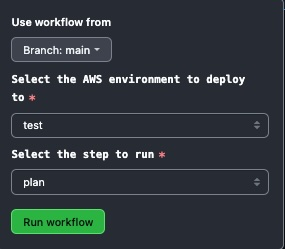
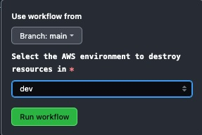

# Sample Github actions based workflow for Terraform based infrastructure.

The workflows referenced in the repo utilize the following capabilities:
- Target AWS account
- GitHub Environments
- GitHub's OIDC based IAM Role assumption
- Action marketplace for some of the common actions.
- Terraform AWS provider

The deployment workflows are set to trigger on a pull_request, push or workflow_dispatch event. The workflows are invoking a single deployment template which is effectively used with some key inputs. The `environment` keyword in the GitHub actions workflows is used to identify the environment on GitHub environments to interact with. This could include environment variables or secrets to pull down and use in the workflow steps.

The workflow is designed as :
- Any pull request opened against `main` which is the default branch gets deployed to `dev` AWS account.
- Any push to main, including merging a PR into main results in an auto dev deployment.
- A workflow dispatch trigger is added for higher environments with some options:
    - For teams who want to test their current infrastructure configuration before deploying anything, they can use the plan step.
    - For the final apply stage, the `apply` selection for step would be required.
    - The branch selection is available as per normal workflow_dispatch options. 
    - The branches from a which a deployment can occur to a target environment ( mirrored by the GitHub environment) can be set with rules on the environment.

- A `destroy` workflow is also added which allows you to clean up your resources from a target AWS account using the additional input of environment along with step_name set to `destroy`

